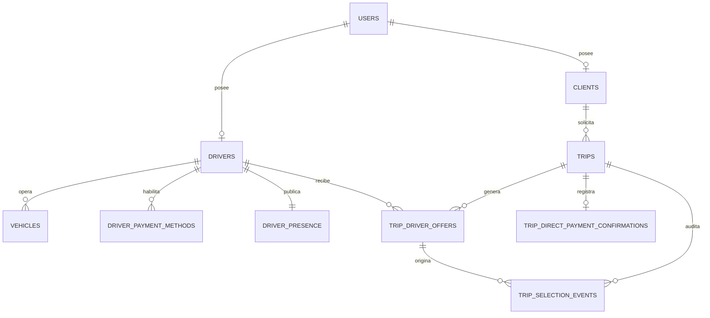

# Modelo de datos de pago directo y selección manual de conductor

**Autor:** Manus AI  
**Estado:** Diseño de referencia para producción.  
**Base objetivo:** MySQL 8.4/InnoDB, compatible con el esquema Drizzle existente de Passenger.

## 1. Decisión de arquitectura

Se recomienda mantener **MySQL como fuente de verdad transaccional**. El proyecto ya modela `users`, `clients`, `drivers`, `vehicles` y `trips` en MySQL; por ello, duplicar esos datos en una base documental como sistema principal aumentaría el riesgo de discrepancias entre la solicitud, la respuesta del conductor y el viaje aceptado. Las claves foráneas permiten expresar las relaciones y mantener la consistencia entre tablas relacionadas. [1]

El sistema no procesa dinero de un viaje. Por tanto, el modelo almacena únicamente los **métodos de pago directo que el conductor declara aceptar**, su política de revelación y —si se requiere para soporte— una confirmación declarativa de que las partes resolvieron el pago. No almacena números de tarjeta, cuentas bancarias sin cifrar, tokens de procesadores, ni transacciones de Zelle, Cash App, PayPal o bancos.

> **Regla de negocio:** el pasajero selecciona un conductor. La plataforma solo ejecuta Autobúsqueda después de un rechazo o vencimiento de la oferta elegida. La asignación final existe únicamente cuando dicho conductor acepta.

## 2. Entidades y relaciones



| Entidad | Responsabilidad | Información crítica |
|---|---|---|
| `drivers` existente | Perfil estable, verificación, vehículo y métricas. | Se amplía con radio de servicio y visibilidad del perfil. |
| `driver_payment_methods` | Métodos directos habilitados por conductor. | Método, estado, visibilidad y dato de contacto cifrado opcional. |
| `driver_presence` | Estado efímero operativo y última ubicación válida. | Disponibilidad, punto geográfico, precisión y `last_seen_at`. |
| `trips` existente | Solicitud y viaje contractual entre pasajero y conductor. | Modo de selección, estado de asignación y versión de concurrencia. |
| `trip_driver_offers` | Cada propuesta manual o de Autobúsqueda a un conductor. | Origen, secuencia, expiración, respuesta y motivo. |
| `trip_selection_events` | Auditoría inmutable de las decisiones. | Actor, evento, fecha y metadatos no sensibles. |
| `trip_direct_payment_confirmations` | Registro opcional y declarativo, no financiero. | Método elegido y acuse de ambas partes; nunca un cobro. |

## 3. Estados del viaje y de la oferta

La aplicación debe separar el **estado global del viaje** del **estado de cada oferta**. De ese modo, un rechazo no convierte el viaje en cancelado; deja al pasajero con una decisión transparente: elegir otro conductor o activar Autobúsqueda.

| Objeto | Estados permitidos | Transición relevante |
|---|---|---|
| `trips.assignment_state` | `choosing_driver`, `awaiting_driver`, `accepted`, `manual_declined`, `auto_searching`, `cancelled`, `expired` | `choosing_driver → awaiting_driver` cuando el pasajero elige; `awaiting_driver → manual_declined` tras rechazo/expiración; `manual_declined → auto_searching` solo por acción explícita. |
| `trip_driver_offers.status` | `pending`, `seen`, `accepted`, `declined`, `expired`, `cancelled`, `skipped` | Una oferta activa por viaje; una aceptación asigna el conductor al viaje. |
| `driver_presence.availability` | `offline`, `online`, `paused`, `busy` | Solo `online` y con señal fresca puede aparecer en la lista de cercanos. |
| Confirmación directa | `not_recorded`, `passenger_declared`, `driver_acknowledged`, `disputed` | Es un acuse operativo opcional, no una confirmación de transferencia ni de liquidación. |

## 4. Esquema SQL recomendado

El SQL completo está disponible en [`sql/direct-payment-driver-selection.sql`](../sql/direct-payment-driver-selection.sql). El diseño conserva las claves `INT` actuales del proyecto y añade tablas normalizadas. Los datos flexibles de auditoría usan `JSON`; MySQL valida los documentos JSON y permite indexar valores concretos con columnas generadas si más adelante fueran necesarios. [2]

| Tabla o cambio | Claves e índices | Justificación |
|---|---|---|
| `drivers` | `service_radius_miles`, `verification_status`, `public_profile_enabled` | Completa el perfil sin duplicar al conductor. |
| `driver_payment_methods` | Único `(driver_id, method)` e índice de métodos visibles | Evita métodos duplicados y permite cambiar la disponibilidad por método. |
| `driver_presence` | PK `driver_id`, índice `(availability, last_seen_at)` y `SPATIAL INDEX(location)` | Resuelve cercanía y excluye presencias vencidas. Las columnas espaciales indexadas requieren `NOT NULL` y un SRID restringido; se utiliza SRID 4326. [3] |
| `trips` | Índices por cliente/estado, conductor/estado y estado de asignación | Mantiene la solicitud, no su historial de ofertas. |
| `trip_driver_offers` | Índice temporal por conductor, orden de secuencia y clave generada única por viaje activo | Impide dos ofertas activas simultáneas para el mismo viaje. |
| `trip_selection_events` | Índice `(trip_id, occurred_at)` | Da trazabilidad a soporte y resolución de disputas. |
| `trip_direct_payment_confirmations` | `UNIQUE(trip_id)` | No crea un procesador de pagos ni una cartera de la plataforma. |

### 4.1. Protección de datos de cobro

La etiqueta del método puede mostrarse al pasajero antes de enviar la oferta. Un alias de Zelle, Cash App, PayPal o transferencia solo debe revelarse en la etapa configurada por el conductor, por defecto después de aceptar. El valor debe guardarse en `handle_ciphertext` con cifrado de aplicación y una clave administrada fuera de la base de datos; `handle_hint` puede contener una pista no sensible, como `***42`, si el producto realmente la necesita.

Los datos de banco existentes en la tabla `drivers` no deben reutilizarse para esta funcionalidad. Deben tratarse como un asunto separado de migración y retención, porque no son necesarios para que el pasajero pague directamente al conductor.

### 4.2. Consulta de conductores cercanos

La consulta debe filtrar primero por `availability = 'online'`, por señal reciente —por ejemplo, menos de 45 segundos— y por verificación. Después aplica un rectángulo geográfico indexado y calcula la distancia exacta para ordenar. El índice espacial utiliza una estructura R-tree y es apropiado para la preselección geográfica; la distancia precisa se calcula sobre el conjunto ya reducido. [3]

```sql
-- Pseudoconsulta: parámetros preparados por el servidor, nunca concatenados.
SELECT p.driver_id, d.first_name, d.last_name, d.averageRating,
       ST_Distance_Sphere(p.location, :pickup_point) / 1609.344 AS miles_away
FROM driver_presence AS p
JOIN drivers AS d ON d.id = p.driver_id
WHERE p.availability = 'online'
  AND p.last_seen_at >= UTC_TIMESTAMP() - INTERVAL 45 SECOND
  AND d.status = 'active'
  AND d.verification_status = 'verified'
  AND MBRWithin(p.location, :search_envelope)
HAVING miles_away <= d.service_radius_miles
ORDER BY miles_away ASC, d.averageRating DESC
LIMIT 20;
```

El adaptador geoespacial debe construir `:pickup_point` y `:search_envelope` con SRID 4326 y una convención única de orden de coordenadas. Conviene conservar además `latitude` y `longitude` como campos de depuración si el equipo los usa para telemetría, pero la elección de cercanos debe salir de la columna espacial.

### 4.3. Transacción de selección manual

La creación o respuesta de una oferta se ejecuta en una transacción con bloqueo de la fila de `trips` o con control optimista sobre `selection_version`. El objetivo es impedir que dos respuestas simultáneas asignen conductores diferentes.

```text
1. Bloquear el viaje solicitado y comprobar assignment_state.
2. Validar que el conductor está online, verificado y dentro del radio.
3. Crear una oferta manual pending con vencimiento; cambiar el viaje a awaiting_driver.
4. Cuando el conductor responde, volver a bloquear el viaje.
5. Si acepta, marcar la oferta accepted, cancelar las pendientes, fijar trips.driver_id y cambiar el viaje a accepted.
6. Si rechaza o vence, marcar la oferta y cambiar el viaje a manual_declined.
7. Solo una acción del pasajero puede iniciar auto_searching y crear la siguiente oferta.
8. Registrar cada paso en trip_selection_events y confirmar la transacción.
```

Las referencias y columnas usadas en estas transacciones deben ser compatibles en tipo y motor; MySQL exige índices para los lados de una relación de clave foránea y utiliza esas relaciones para evitar referencias huérfanas. [1]

## 5. Alternativa NoSQL complementaria

No se aconseja usar NoSQL como fuente de verdad del viaje, pero puede complementar MySQL para presencia de alta frecuencia, caché de candidatos o publicación en tiempo real. Una estructura de documentos coherente sería la siguiente:

```json
{
  "drivers/{driverId}": {
    "profile": {"verificationStatus": "verified", "serviceRadiusMiles": 12},
    "paymentMethods": {
      "cash": {"enabled": true, "discloseAt": "offer"},
      "zelle": {"enabled": true, "discloseAt": "accepted", "handleCiphertext": "..."}
    }
  },
  "driverPresence/{driverId}": {
    "availability": "online",
    "geo": {"lat": 28.5383, "lng": -81.3792},
    "lastSeenAt": "2026-08-22T14:00:00Z",
    "ttlSeconds": 60
  },
  "trips/{tripId}": {
    "assignmentState": "awaiting_driver",
    "selectedDriverId": "drv_123",
    "selectionVersion": 4,
    "offers": [{"sequence": 1, "source": "manual", "status": "pending"}]
  }
}
```

El servicio de tiempo real debe tratar estos documentos como una proyección o caché. Cada aceptación/rechazo se valida y persiste primero en MySQL, después se emite por Socket.IO y, si existe, se actualiza la proyección NoSQL. Esta regla evita que un cliente pueda convertir una notificación en una asignación definitiva sin una transacción del servidor.

## 6. Contrato de persistencia y API

| Operación de servidor | Escritura principal | Evento de tiempo real |
|---|---|---|
| Conductor actualiza métodos | `driver_payment_methods` | `driver:payment-methods-updated` solo al conductor. |
| Conductor publica GPS/disponibilidad | `driver_presence` | `driver:presence` para sistemas internos; no exponer ubicación exacta antes de la aceptación. |
| Pasajero solicita lista | Solo lectura de presencia, perfil y métodos visibles. | No crea oferta. |
| Pasajero elige conductor | Inserta `trip_driver_offers`, actualiza `trips` y crea evento. | `trip:offer-created` a la sala segura del conductor. |
| Conductor responde | Actualiza oferta, viaje y evento dentro de una transacción. | `trip:driver-response` a la sala del viaje. |
| Pasajero pulsa Autobúsqueda | Verifica rechazo/expiración, crea oferta secuencial y evento. | `trip:auto-search-started`. |

El backend debe obtener el rol desde el JWT y verificar que el pasajero es el propietario de `trips.client_id` y que el conductor es el receptor de la oferta. La aplicación cliente nunca debe enviar un `driver_id` para aceptar en nombre de un conductor ni modificar `assignment_state` directamente.

## 7. Plan de migración sin interrumpir la demo

| Fase | Cambio | Criterio de salida |
|---|---|---|
| 1 | Crear tablas nuevas e índices sin retirar columnas heredadas. | Migración aplicada y verificada en staging. |
| 2 | Habilitar escritura dual desde el panel de conductor: almacenamiento local para demo y API para producción. | Los métodos sobreviven recarga y nueva sesión. |
| 3 | Activar presencia persistente y lista de conductores reales. | Solo conductores con señal fresca aparecen. |
| 4 | Activar ofertas transaccionales, rechazo y Autobúsqueda. | No pueden existir dos ofertas activas por viaje. |
| 5 | Retirar el cobro de viajes de los flujos `payments`, `stripe` y `paypal`; conservarlos únicamente para facturación SaaS si aplica. | Ningún viaje intenta crear un cargo de plataforma. |

## 8. Referencias

[1]: https://dev.mysql.com/doc/refman/8.4/en/create-table-foreign-keys.html "MySQL 8.4 Reference Manual — FOREIGN KEY Constraints"

[2]: https://dev.mysql.com/doc/refman/8.4/en/json.html "MySQL 8.4 Reference Manual — The JSON Data Type"

[3]: https://dev.mysql.com/doc/refman/8.4/en/creating-spatial-indexes.html "MySQL 8.4 Reference Manual — Creating Spatial Indexes"
